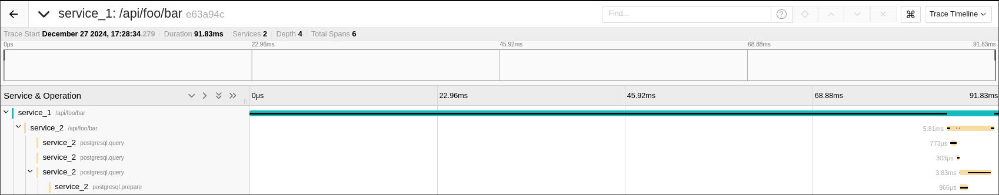
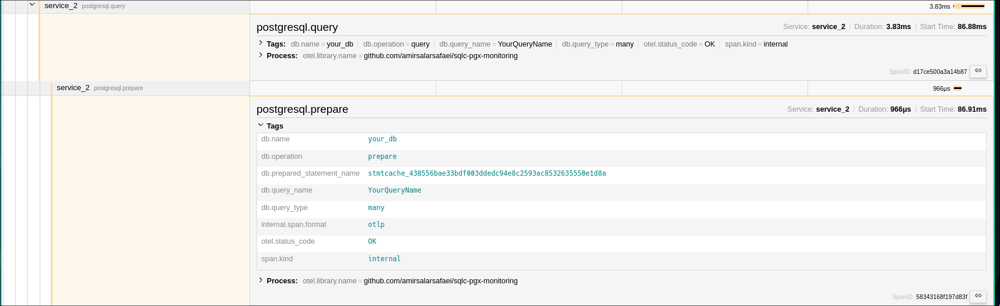
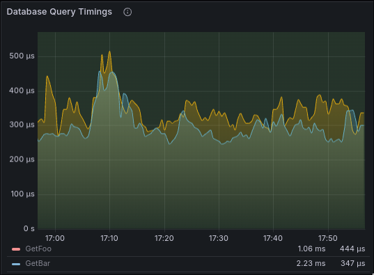

# sqlc-pgx-monitoring


[](https://codecov.io/github/amirsalarsafaei/sqlc-pgx-monitoring)

`sqlc-pgx-monitoring` is a Go package that offers powerful query time monitoring and logging capabilities for applications using the popular `pgx` and `sqlc` libraries in Golang. If you want to gain insights into the performance of your PostgreSQL database queries and ensure the reliability of your application, this package is a valuable addition to your toolset.

## Features

- **Complete OpenTelemetry Support**: Built-in integration with OpenTelemetry for comprehensive observability, including metrics, traces, and spans for all database operations. Traces every database interaction including:
  - Individual queries
  - Batch operations
  - Prepared statements
  - Connection lifecycle
  - COPY FROM operations
 
- **OpenTelemetry Semantic Convention**: Aligned with Otel's semantic convetions ([defined here](https://opentelemetry.io/docs/specs/semconv/database/)). 

- **Modern Structured Logging**: Native support for Go's `slog` package, providing structured, leveled logging that's easy to parse and analyze.

- **Query Time Monitoring**: Keep a close eye on the execution times of your SQL queries to identify and optimize slow or resource-intensive database operations. It uses name declared in sqlc queries in the label for distinguishing queries from each other.

- **Detailed Logging**: Record detailed logs of executed queries, including name, parameters, timings, and outcomes, which can be invaluable for debugging and performance analysis.

- **Compatible with `pgx` and `sqlc`**: Designed to seamlessly integrate with the `pgx` database driver and the `sqlc` code generation tool, making it a great fit for projects using these technologies.

## Installation

To get started with `sqlc-pgx-monitoring`, you can simply use `go get`:

```shell
go get github.com/amirsalarsafaei/sqlc-pgx-monitoring@v1.5.0
```

## Usage

To begin using `sqlc-pgx-monitoring` in your Go project, follow these basic steps:

1. Import the package:
   ```go
   import "github.com/amirsalarsafaei/sqlc-pgx-monitoring/dbtracer"
   ```

2. Before creating connection or connection pool, assign dbTracer in your connection config:

   ### pgx.Conn
   ```go
   connConfig.Tracer = dbtracer.NewDBTracer(
      "database_name",
   )
   ```
   ### pgxpool.Pool
   ```go
   poolConfig.ConnConfig.Tracer = dbtracer.NewDBTracer(
      "database_name",
   )
   ```

### Available Options

The `NewDBTracer` function accepts various options to customize its behavior:

#### Logging Options
- `WithLogger(logger *slog.Logger)`: Sets a custom structured logger for query logging
- `WithShouldLog(shouldLog ShouldLog)`: Configures when to log based on error conditions
- `WithLogArgs(enabled bool)`: Enables/disables logging of query arguments
- `WithLogArgsLenLimit(limit int)`: Sets maximum length for logged arguments

#### Telemetry Options
- `WithMeterProvider(mp metric.MeterProvider)`: Sets the OpenTelemetry meter provider for metrics
- `WithTraceProvider(tp trace.TracerProvider)`: Sets the OpenTelemetry tracer provider
- `WithLatencyHistogramConfig(name, unit, description string)`: Configures the latency histogram properties
  ```go
  dbtracer.NewDBTracer(
      "database_name",
      dbtracer.WithLatencyHistogramConfig(
          "custom_histogram_name",
          "ms",
          "Custom histogram description",
      ),
  )
  ```

#### Example Usage

```go
logger := slog.New(slog.NewTextHandler(os.Stdout, nil))
mp := metric.NewMeterProvider()
tp := trace.NewTracerProvider()

tracer := dbtracer.NewDBTracer(
    "database_name",
    dbtracer.WithLogger(logger),
    dbtracer.WithMeterProvider(mp),
    dbtracer.WithTraceProvider(tp),
    dbtracer.WithLogArgs(true),
    dbtracer.WithLogArgsLenLimit(1000),
    dbtracer.WithShouldLog(func(err error) bool {
        return err != nil // Only log when there's an error
    }),
)
```

For more information refer to the [example](internal/example)


### Tracing and Monitoring Visualization
### Tracing



### Monitoring


## License

`sqlc-pgx-monitoring` is open-source software licensed under the [MIT License](LICENSE). Feel free to use, modify, and distribute it according to the terms of this license.

## Contributing

We welcome contributions from the community. If you have suggestions, bug reports, or want to contribute to the development of `sqlc-pgx-monitoring`, please refer to our [contribution guidelines](CONTRIBUTING.md).

Happy querying and monitoring with `sqlc-pgx-monitoring`!
